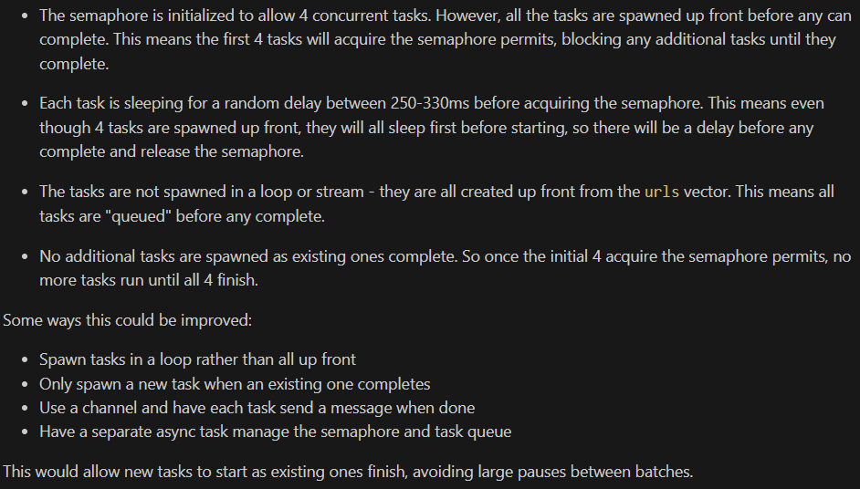

Js puppeteer based scraper 

```
1 CD C:\Users\dpolzer\Me\Git\ln-scrapper>
2 node .\js\ln_scrapper.js
```

> Outputs to file 'jobs.csv'


Rust Job details Scraper

Example HTML for each scraped job 

```html
<div
  class="show-more-less-html__markup show-more-less-html__markup--clamp-after-5 relative overflow-hidden"
>
  <strong>Test Analyst – UK Leading MedTech Firm – Hybrid – Milton Keynes<br /><br /></strong>(Tech
  stack: <strong>Test Analyst, Automation, C#, Selenium, Azure,</strong> Test Engineer, QA Analayst,
  QA Engineer, QA Automation, QA Tester, test Analyst)<br /><br />Our client is one of the UK’s
  leading software providers of Shared Care and Health analytics solutions. A “Cloud First”
  organisation, they are one of Microsoft’s largest UK healthcare data customers with a variety of
  Azure services and technologies embedded across their suite of solutions. Due to the rapid growth
  over the last year has seen the test teams growing in number, they are seeking a talented
  individual to join the development team as a Test Anlayst.<br /><br />There are plenty of
  opportunities to grow and develop your skills within this company and they have been awarded an
  ‘outstanding’ accreditation from Best Companies for workplace engagement and has featured as one
  of the UK’s Top 100 Mid-sized companies to work for.<br /><br />The ideal candidate would be able
  to demonstrate 4+ years of practical experience working within automation-oriented roles with C#,
  with a particular focus on system integration level testing. Key responsibilities include
  co-ordinating, planning and executing automation testing activities for our key azure based
  projects.<br /><br />The ideal Test Analyst will have experience in some or all the following
  (full training will be provided to fill any gaps in your skills set):
  <strong>Automation, C#, Selenium, Azure,</strong> MS Azure technologies, SQL, .Net core, visual
  studio, NUnit, Manual testing.<br /><br /><strong
    >The Test Analyst Position Comes With The Following Benefits<br /><br
  /></strong>
  <ul>
    <li>Hybrid – Once a month in the office, rest of the days remote working</li>
    <li>Travel expenses are covered</li>
    <li>Flexible hours</li>
    <li>Stock option plan</li>
    <li>Annual bonus</li>
    <li>Pension contribution by the company</li>
    <li>Private medical</li>
    <li>26 days annual leave</li>
    <li>Birthdays off</li>
    <li>Friday evening drinks</li>
    <li>Development and training programs</li>
    <li>Awesome work environment at a company with a huge vision.</li>
    <li>Killer office with an onsite gym and games room!<br /><br /></li>
  </ul>
  <strong>Location:</strong> Milton Keynes / Hybrid Working<br /><br /><strong>Salary:</strong>
  £45,000 – £55,000 + Bonus + Pension + Benefits<br /><br />NOIRUKTECHREC<br /><br />NOIRUKREC
</div>
```


### Async rust issues
 


### Running tests 

> Cargo.toml has registration bellow which marks tests path
```
[[tests]]
path = "tests"
```

All you  need to do is 
```shell
# cd into project folder and run 'test' command since we only have single test file
cd C:\Users\dpolzer\Me\Git\ln-scrapper
cargo test
#or cargo test -- --nocapture to see output
```